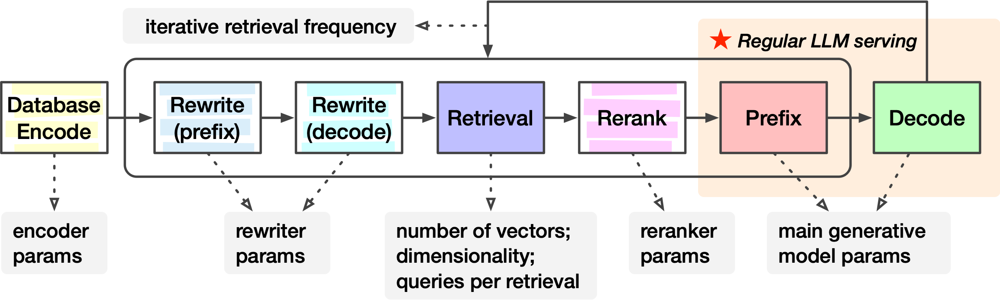
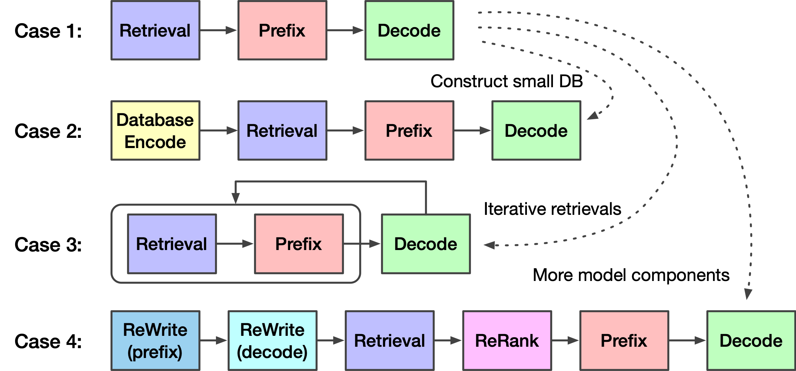
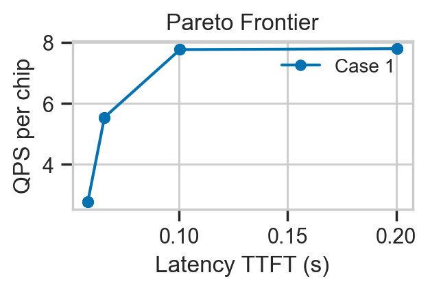
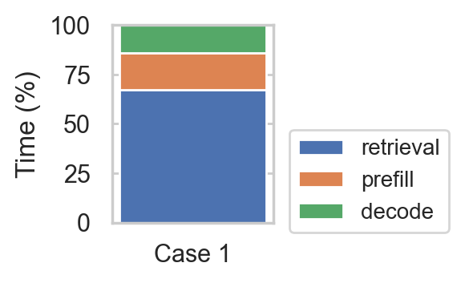
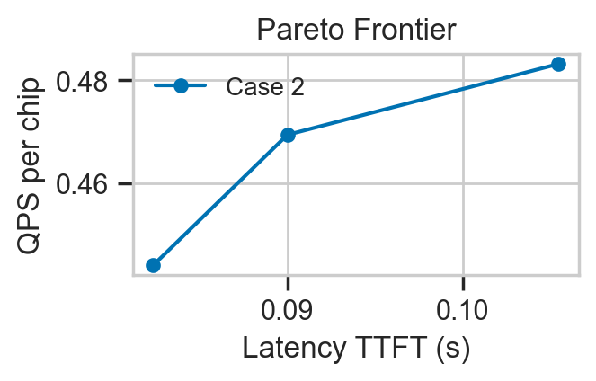
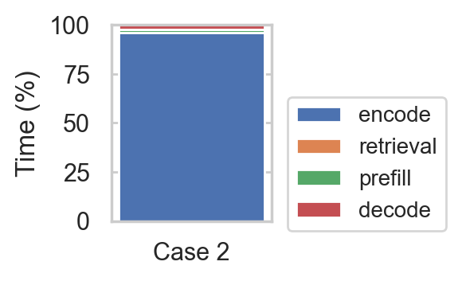
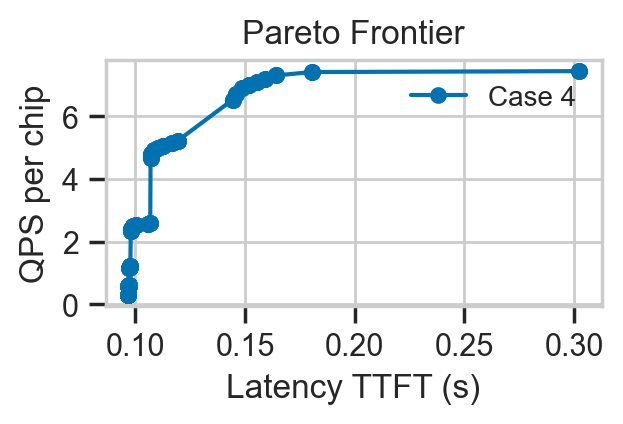
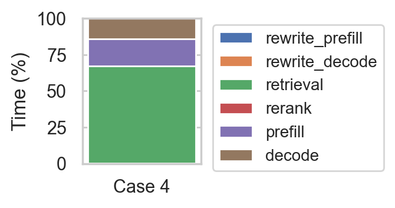

# Performance Analysis Examples


In general, a RAG algorithm can be represented by RAG-Schema as we introduced in our [RAGO paper](https://arxiv.org/pdf/2503.14649):




This folder contains some example executions of the case studies introduced in the RAGO paper. Speficially:

Case I: RAG with hyper-scale retrievals. `Retrieval -> LLM Prefill -> LLM Decode`

Case II: RAG for long-context processing. `Database Encode -> Retrieval -> LLM Prefill -> LLM Decode`

Case III: RAG with iterative retrievals. `Retrieval -> LLM Prefill -> LLM Decode -> Retrieval -> LLM Prefill -> LLM Decode -> ...`

Case IV: RAG with Query Rewriter and Reranker. `Query Rewrite -> Retrieval -> Rerank -> LLM Prefill -> LLM Decode`




## Execute Performance Analysis 

### Case 1: RAG with hyper-scale retrievals

The specific algorithm and hardware configurations can be edited in [example_case1.py](example_case1.py).

```
python example_case1.py
```

Example performance results:






### Case 2: RAG for long-context processing

The specific algorithm and hardware configurations can be edited in [example_case2.py](example_case2.py).

```
python example_case2.py
```

Example performance results:






### Case 3: RAG with iterative retrievals

The specific algorithm and hardware configurations can be edited in [example_case3.py](example_case3.py).

```
python example_case3.py
```

Example performance results:


### Case 4: RAG with Query Rewriter and Reranker

The specific algorithm and hardware configurations can be edited in [example_case4.py](example_case4.py).

```
python example_case4.py
```

Example performance results:



